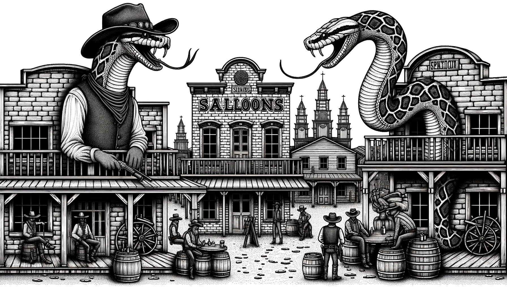

# Data Wrangling (aka data munging) using core Python (Collections, Itertools, Functools)    

<html> 
	  
	<p font-size="8px">Data Wrangling with Core Python</p> 
	<br/>
</html>
  
This set of notebooks works through examples of how some pretty sophisticated data engineering can be done using Python Collections, Itertools and Functools. It uses the [small MovieLens dataset](https://grouplens.org/datasets/movielens/#:~:text=Small%3A%20100%2C000%20ratings%20and%203%2C600%20tag%20applications). 
  
* Basic Collections and the ```Collections``` Module: [Notebook](https://github.com/shauryashaurya/learn-data-munging/blob/main/00-Python-Collections/01.01%20Data-Wrangling-with-Plain-Old-Python.ipynb) also [](https://colab.research.google.com/github/shauryashaurya/learn-data-munging/blob/main/00-Python-Collections/01.01%20Data-Wrangling-with-Plain-Old-Python.ipynb) 