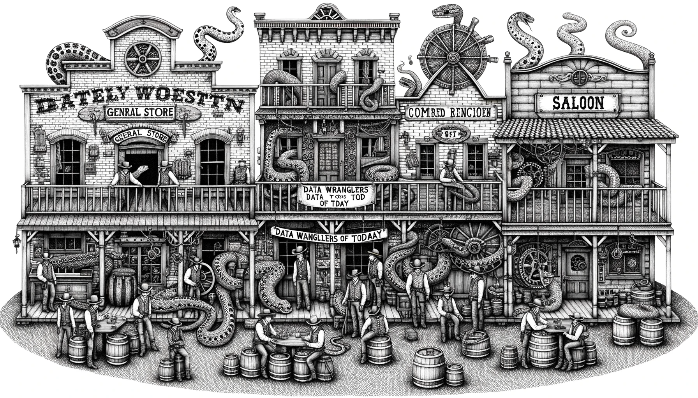

# Data Munging with NumPy    
  
<html> 
	  
	
Data Wrangling with Core Python
 
	 
</html>
   
  
Uses the [small MovieLens dataset](https://grouplens.org/datasets/movielens/#:~:text=Small%3A%20100%2C000%20ratings%20and%203%2C600%20tag%20applications). 

### 01 [Numpy](https://github.com/shauryashaurya/learn-data-munging/tree/main/01-Numpy)    
  
* NumPy vs Python Collections [Notebook](https://github.com/shauryashaurya/learn-data-munging/blob/main/01-Numpy/02.01-Numpy-over-Python-Collections.ipynb) also  
  
   
   
  .